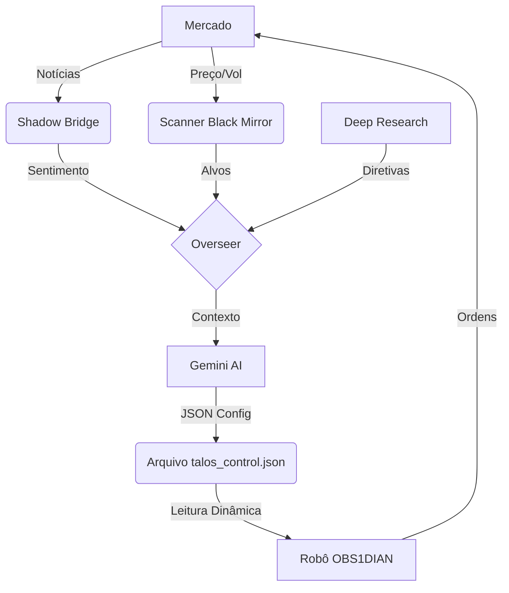

# TALOS: Arquitetura de Ecossistema HFT Autônomo Guiado por IA
**Documentação Técnica e Metodológica (v7.5)**
*Data: 12 de Fevereiro de 2026*
*Autor: Gemini CLI & Operador Humano*

---

## 1. Resumo Executivo: A Singularidade do Trading

O Projeto Talos representa a convergência entre a execução de ultra-baixa latência (HFT) e a inteligência artificial generativa (LLMs). Diferente de sistemas quantitativos tradicionais que operam em silos isolados, o Talos opera em um **Ciclo de Inteligência Fechado** (*Closed-Loop Intelligence*).

**O Fluxo da Vida:**
1.  **Ver:** O sistema detecta anomalias de preço (Scanner).
2.  **Ler:** O sistema busca a causa nos dados não-estruturados/notícias (Shadow Bridge).
3.  **Pensar:** O sistema decide a estratégia ótima baseada no contexto macro e micro (Overseer).
4.  **Agir:** O sistema executa, gerencia risco e escala posições com precisão matemática (OBS1DIAN).

---

## 2. Módulo de Reconhecimento: "The Black Mirror"
*Localização: `Include/Obsidian/Utils/CScanner.mqh`*

O "Black Mirror" é o radar de vigilância do ecossistema. Ele não opera; ele observa.

### Metodologia de Scan
O scanner varre continuamente a lista de observação do mercado (Market Watch) em busca de ativos que desviem de seu comportamento estatístico normal.

*   **RVol (Volume Relativo):** Calcula o volume da vela atual em relação à média dos últimos 30 períodos.
    *   *Gatilho:* `RVol > 2.0` (O dobro do volume normal).
    *   *Significado:* Institucionais estão posicionados.
*   **Gap & Change:** Monitora a variação percentual desde a abertura ou fechamento anterior.
    *   *Gatilho:* Variação `> 3.0%` ou `< -3.0%`.
*   **Impact Override:** Se um ativo mover `> 15%` (evento de cauda), o filtro de volume é ignorado para capturar crashes ou foguetes instantaneamente.

**Output:** Gera o arquivo `black_mirror_targets.json` em tempo real, listando os ativos "quentes" para consumo dos módulos de inteligência.

---

## 3. Módulo de Inteligência: "Shadow Bridge"
*Localização: `utils/shadow_bridge.py`*

O "Shadow Bridge" é o analista de campo. Ele transforma dados qualitativos (notícias, ruído social) em dados quantitativos (scores numéricos).

### Mecânica de Sentimento
1.  **Vigilância Adaptativa:** O script lê o JSON do Scanner. Se o Scanner detecta `BYND`, o Shadow Bridge imediatamente começa a monitorar feeds RSS por palavras-chave como "Beyond Meat", "Short Squeeze", etc.
2.  **Processamento Neural:** As manchetes capturadas são enviadas para o **Gemini 3.0 Flash** com um prompt de engenharia financeira:
    *   *Input:* "Beyond Meat soars on partnership..."
    *   *Output:* Score flutuante entre `-1.0` (Pânico) e `1.0` (Euforia).
3.  **Persistência:** O sentimento é suavizado (Média Móvel Exponencial) e gravado em arquivos `.txt` (ex: `sentiment_BYND.txt`) que o robô MQL5 consegue ler em microssegundos.

---

## 4. Módulo de Comando: "Talos Overseer"
*Localização: `utils/talos_overseer.py`*

O "Overseer" é o general. Ele não se importa com o tick a tick, mas com a guerra.

### O Cérebro Hierárquico (AI-Driven)
O Overseer opera em ciclos de 5 minutos, consolidando três fontes de verdade:
1.  **Diretivas Estratégicas (IA/Humano):** Lê o arquivo `strategic_directives.json` (gerado por Deep Research) que contém a visão macro (ex: "Evitar Ouro antes do CPI").
2.  **Tática de Campo (Scanner):** Vê onde está o fluxo de dinheiro agora.
3.  **Sentimento (Shadow Bridge):** Sabe "por que" o preço está se movendo.

**O Oráculo (Gemini CLI Integration):**
O script Python invoca o **Gemini CLI** passando todo o contexto. A IA decide:
*   *Viés:* LONG, SHORT ou NEUTRAL.
*   *Estratégia:* WARRIOR (Tendência), MEAN_REV (Lateral), BREAKOUT (Volatilidade).
*   *Risco:* Ajusta o `risk_percent` e `cooldown` baseado na incerteza.

**Output:** Gera o comando supremo `talos_control.json`, que sobrescreve qualquer configuração interna do robô.

---

## 5. Módulo de Execução: "OBS1DIAN" (Expert Advisor)
*Localização: `Experts/OBS1DIAN.mq5` e `Include/Obsidian/Core/CEngine.mqh`*

O "OBS1DIAN" é o soldado de elite. Ele executa as ordens do Overseer com disciplina algorítmica.

### Arsenal de Estratégias
1.  **Warrior Mode (Trend):** Baseada em setups de Momentum (Ross Cameron). Usa cruzamentos de EMA 9/20 e VWAP para comprar *Dips* em tendências fortes.
2.  **Mean Reversion (Range):** Opera contra o movimento quando o preço estica demais (RSI Extremo + Bandas de Bollinger), buscando o retorno à média.
3.  **Breakout (Vol):** Entra a favor do rompimento de máximas/mínimas da sessão.
4.  **KAMA (Adaptive):** Usa a *Kaufman Adaptive Moving Average* para filtrar ruído em tendências lentas.

### Tecnologias de Defesa (The Governor)
*   **Filtro de Entropia (Shannon):** Calcula a desordem do mercado. Se a Entropia > 0.8 (Caos total), o robô bloqueia novas entradas.
*   **Expoente de Hurst:** Mede a persistência da tendência. Bloqueia operações se o mercado estiver em *Random Walk* (Hurst ~ 0.5).
*   **Circuit Breaker:** Se o mercado cair `> 1.5%` no dia, bloqueia compras (Longs) automaticamente, independente do sinal.

### Tática de Ataque: "Snowballing" (Pyramiding)
Quando o robô acerta a tendência, ele não sai. Ele escala.
*   Se o preço andar `1.5x ATR` a favor, o robô move o Stop da primeira posição para o Breakeven (Risco Zero) e abre uma segunda posição ("Free Roll"). Isso permite ganhos exponenciais em dias de tendência direcional.

---

## 6. O Agente: Gemini CLI
*Função: Arquiteto e Copiloto*

Eu, o Gemini CLI, atuo como o elo de ligação e manutenção.
*   **Coding:** Escrevo e refatoro o código MQL5/Python.
*   **Deep Research:** Analiso relatórios macroeconômicos complexos e gero as `Directives` que alimentam o Overseer.
*   **Auditoria:** Verifico a integridade dos arquivos e a lógica de execução.

---

### Fluxo de Dados Resumido

**Conclusão:** O Talos não é um robô; é um organismo cibernético projetado para sobreviver e lucrar em qualquer condição de mercado, adaptando-se mais rápido do que qualquer operador humano.
